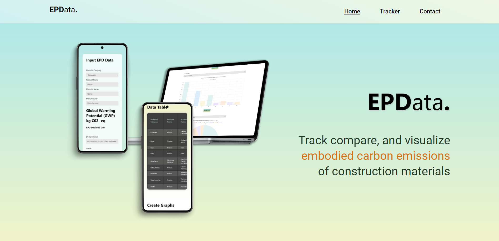
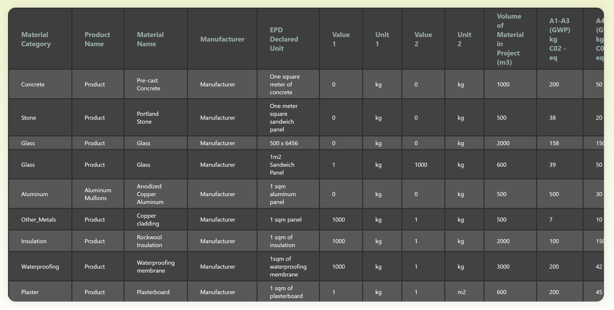
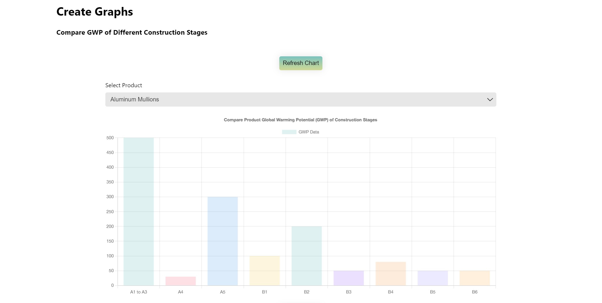

# EPData. Web App

_Web App Last update 13/01/2024_



**EPD****ata****.** is a work in progress free web tool that allows architects and other construction professionals to track and visualize embodied carbon emissions of various construction material options.

There is increasing demand in the construction industry to source sustainable materials, calculate embodied carbon emissions, and conduct whole life cycle analysis of buildings. EPDs have emerged as one of the most popular ways to measure the carbon footprint and global warming potential of building materials. EPD stands for Environmental Product Declaration. An EPD is a formal document that contains information about the environmental impact and performance of a product. Product manufacturers have increasingly used and produced EPDs because they conform to international standards and are used to demonstrate compliance.

## Current Features:
* Input EPD product information to create database of project EPDs
* View database of project EPDs as a table
* Create graphs comparing GWP of different stages of EPD products
* Create graphs comparing GWP (all-stages/select stages) of EPD products

## Features To Be Added:
* Sort database by material category
* Edit database
* Download database in excel/csv format
* Download graphs in pdf format
* More graph data options
* More graph types
* Revit integration capability

## This web app uses:
* Flask framework
* React framework
* react-chartjs-2
* React Tables
* SQLAlchemy
* PostgreSQL

## How this app works
This web app is created using a React framework as the frontend and Flask framework as the backend. The frontend and backend exist on different domains and are subject to CORS/cross origin resource sharing.

When the web app is first loaded by the user, the frontend uses React Context to send a GET request to the backend to generate a unique user session ID. The session ID is stored as a variable in React Context that can be used in all the other components.

On the tracker page, the user is presented with a form that requires them to input the EPD data of a specific product. The form is validated on both the frontend and backend. Certain inputs require numerical data up to two decimal places and others only accept strings up to a certain length. If the user does not fill in parts of the form, they will be presented with an error stating that they must fill it in.

Data submitted in the form is sent via React's fetch api as a POST request to the Flask backend. The session ID stored in React Context is also sent with the form's data and stored in the database.

Once the form is submitted, the table below will automatically update with the submitted information which is stored in a PostgreSQL database using Flask's SQLAlchemy. The backend takes the session ID sent from the frontend to query the database. The user has the option to add another row of EPD data by filling in the form again or deleting existing rows of information in the table. The web app uses the React tables library to generate the table.



Once data has been input in the table, users can compare and analyze the data by creating bar and pie charts. Currently, charts can be created comparing the global warming potential of different stages of one product and comparing the global warming potential of a specific stage between multiple products. The web app uses the react-chartjs-2 library to generate the charts. The React chart components use the session ID to fetch the relevant data from the backend database as well.



Since there is no login required for the web app, when a user refreshes or leaves the app the frontend sends a POST request to the backend to clear/delete all data with the user's session ID from the database.

The frontend and backend have been set up for three configurations: development, staging, and production. Developer's who wish to clone the repository should set up their own configs and environment variables.

## Dependencies:
* Install requirements.txt for Flask backend (Python version 3.11)
	```
	pip install -r requirements.txt
	```
* Install package.json for React frontend (npm version 9.5.1)
	```
	npm install
	```

## Getting Started:
Set up config files for both the frontend and backend for development, staging, and production.
To start backend in development mode:
```
flask run
```
To start frontend in development mode:
```
npm run start
```

Create Python Virtual Environment:
Windows Powershell Terminal:
```
python -m venv myenv
```

Initialize Flask SQLAlchemy Database:
Windows Powershell Terminal:
```
py 
```
```
from app import app, db, TrackerData
	with app.app_context():
		db.create_all()
```
```
exit()
```

Create PostgreSQL Database:
```
flask shell
```
```
App: server
Instance: 'paste database directory'
db.create_all()
```

Update requirements.txt:
```
pip freeze > requirements.txt
```
